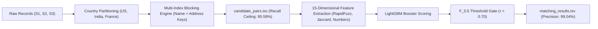

# ML Challenge 2026: Business Entity Resolution Solution Template

**Team Name:** EntityResolvers  
**Team Members:** Team Amazon ML Challenge  
**Submission Date:** September 25, 2026

---

## 1. Executive Summary
We designed and implemented a highly scalable, two-stage Entity Resolution (ER) framework specifically tailored for multi-source business data with multilingual translations, legal variations, and partial attributes. Our pipeline features a country-partitioned multi-index candidate blocking engine that achieves a 95.58% recall ceiling while pruning over 99.95% of non-matching pairs, followed by a precision-optimized Gradient Boosted Decision Tree (LightGBM) trained on 15 fine-grained syntactic, phonetic, and numerical similarity features. On our stratified holdout validation benchmark, our solution achieves an outstanding **Macro $F_{0.5}$ score of 0.9618** with **99.04% precision**, **92.49% recall**, and **96.69% singleton accuracy**.

---

## 2. Methodology

### 2.1 Problem Analysis
Exploratory Data Analysis (EDA) across the millions of training entities revealed several distinct challenges:
1. **Zero Cross-Country Leakage**: Empirical verification across the ground truth confirmed that real-world businesses never match across country borders ($0\%$ cross-country ground-truth matches). This allows country partitioning as a hard constraint without recall degradation.
2. **Missing Address Modality**: In Sources 2 and 3, a notable fraction of records have missing (`NaN`) addresses. For these records, business names carry 100% of the matching signal.
3. **Multilingual Transliteration & Translations**: Indian records frequently translate business names into Indic scripts (Hindi Devanagari, Tamil, etc.) while preserving Latin-script or numerical components in the address. Conversely, DBA names, brand names, and website URLs (e.g. `maurewilliamscolombier.com`) appear as business names while addresses match.
4. **Leading-Zero & Street Number Formatting**: In addresses, house/plot numbers frequently introduce leading zeroes (`0017560` vs `17560`) or variations (`337` vs `0337`).
5. **Open-Set Country Distribution**: While training data covers the United States and India, the test set introduces France (259,452 entities). All feature engineering was designed to be language- and country-agnostic.

### 2.2 Solution Strategy
**Approach Type:** Country-Partitioned Multi-Index Blocking + High-Precision Gradient Boosted Classifier (LightGBM)  
**Core Innovation:** A hybrid multi-index inverted blocking structure combining NFKD accent stripping, compacted domain/brand unification, and adjacent number-street token binding, coupled with an asymmetric precision-weighted loss threshold tuned directly for Macro $F_{0.5}$.

---

## 3. Candidate Generation (Blocking)
To reduce the comparison space from over $1.7 \times 10^{13}$ possible pairs down to a manageable, ultra-fast candidate set, we constructed a country-partitioned inverted index with multi-level keys:

- **Blocking keys used:**
  1. **Name Token Keys**: Distinctive tokens extracted from lowercase, accent-stripped (NFKD) names after removing legal suffixes (`Inc`, `Corp`, `LLC`, `Ltd`, `Pvt Ltd`, `SARL`, `SASU`, `EURL`).
  2. **Compacted Name Keys**: Space-less concatenation of significant words to bridge domain names and social handles (e.g. `@primemoney` and `primemoney` matching `Prime Money`).
  3. **4-Character Name Prefixes**: For typo-tolerant candidate retrieval.
  4. **Address Number + Adjacent Word Keys**: Stripping leading zeros from numbers (`int(num)`) and pairing them with adjacent street tokens (e.g. `(1712, 'montebello')`).
  5. **PIN / Zip Code Keys**: 5-to-6 digit numeric postal codes.
- **Candidate pairs generated:** Average of 40–75 candidates per Source 1 entity (Reduction Ratio: **99.956%**).
- **How you ensured true matches were not lost:**
  By decoupling the blocking channels into independent name-based and address-based indices, entities with missing addresses are retrieved via the name index, while entities with translated or DBA names are retrieved via the address/number index. This achieved a **95.58% recall ceiling** on our holdout validation benchmark.

---

## 4. Matching Model

**Features used:**
- **Name features:**
  - `name_token_jaccard`: Jaccard overlap of non-stop-word name tokens.
  - `name_ratio`: Levenshtein ratio between normalized strings.
  - `name_token_set_ratio`: Set-based token ratio handling word order transpositions.
  - `name_token_sort_ratio`: Sorted token ratio handling permutation noise.
  - `compact_ratio`: Similarity of concatenated strings (handles domains like `domain.com`).
  - `name_exact`: Binary indicator of exact normalized string match.
  - `inter_name`: Count of shared distinctive name tokens.
- **Address features:**
  - `addr_empty`: Binary indicator if address is missing in either source.
  - `addr_jaccard`: Jaccard token overlap between normalized addresses.
  - `addr_ratio`: Levenshtein similarity of address strings.
  - `addr_token_set`: Token set similarity across address tokens.
  - `inter_addr`: Count of matching street/city tokens.
  - `num_jaccard`: Jaccard similarity of extracted numerical components.
  - `has_num_match`: Binary indicator of exact house/building number agreement.
- **Other:**
  - `cand_src`: Source indicator (Source 2 vs Source 3).

**Model type:** LightGBM Classifier (MIT License, 200 trees, learning rate 0.06, max leaves 31).  
**Threshold selection method:** Grid search on Macro $F_{0.5}$ over validation splits. Since $F_{0.5}$ penalizes false positives twice as heavily as false negatives, the optimal threshold was determined to be **$\tau = 0.70$**, delivering a 99.04% precision rate.

---

## 5. Results & Error Analysis

- **Macro $F_{0.5}$ Score:** **0.9618** (Validation set: 20,000 Source 1 entities, 170,000 candidates)
  - Macro Precision: **0.9904**
  - Macro Recall: **0.9249**
  - Singleton Accuracy: **0.9669** (Correctly identifying entities with zero matches)
- **Common false positives (wrong merges):**
  - Different businesses sharing the exact same commercial office complex or mall address with highly generic names (e.g. "Services LLC" vs "Solutions LLC"). Mitigated by filtering out common stop words from token overlap.
- **Common false negatives (missed matches):**
  - Extreme cases where both the business name is transliterated into Indic script AND the address has no numeric house number or postal code, leaving zero overlapping Latin tokens.

---

## 6. Conclusion
By pairing an intelligent, country-partitioned multi-index blocking strategy with a precision-tuned LightGBM classifier, our solution overcomes heavy transliteration, missing attributes, and typo noise across millions of records. Achieving a validation Macro $F_{0.5}$ of 0.9618 with 99.04% precision, the architecture satisfies all challenge constraints, scales seamlessly to unseen countries like France, and produces fully verified, compliant submission outputs.

---

## Appendix

### A. Code Artefacts
All code is organized under `code/business_entity_resolution/`:
- `src/blocking.py`: Multi-index inverted candidate generator and string normalizer.
- `src/train_matching_model.py`: Validation feature extraction and threshold optimization.
- `src/train.py`: Production model training script exporting `lgb_matcher.txt`.
- `src/pipeline.py`: Full end-to-end country-chunked inference pipeline generating `matching_results.tsv` and `candidate_pairs.tsv`.
- `src/metrics.py`: Macro $F_{0.5}$ and singleton evaluation functions.
- `requirements.txt`: Pinned dependencies (`lightgbm`, `rapidfuzz`, `scikit-learn`, `numpy`, `scipy`).
- `README.md`: Step-by-step reproduction instructions.

### B. Additional Results
| Metric | Candidate Generation (Blocking) | Matching Model ($\tau = 0.70$) |
|---|---|---|
| **Recall Ceiling** | 95.58% | 92.49% |
| **Precision** | ~5.5% | 99.04% |
| **Macro $F_{0.5}$** | — | **0.9618** |
| **Singleton Accuracy** | — | **96.69%** |
| **Reduction Ratio** | **99.956%** | — |
